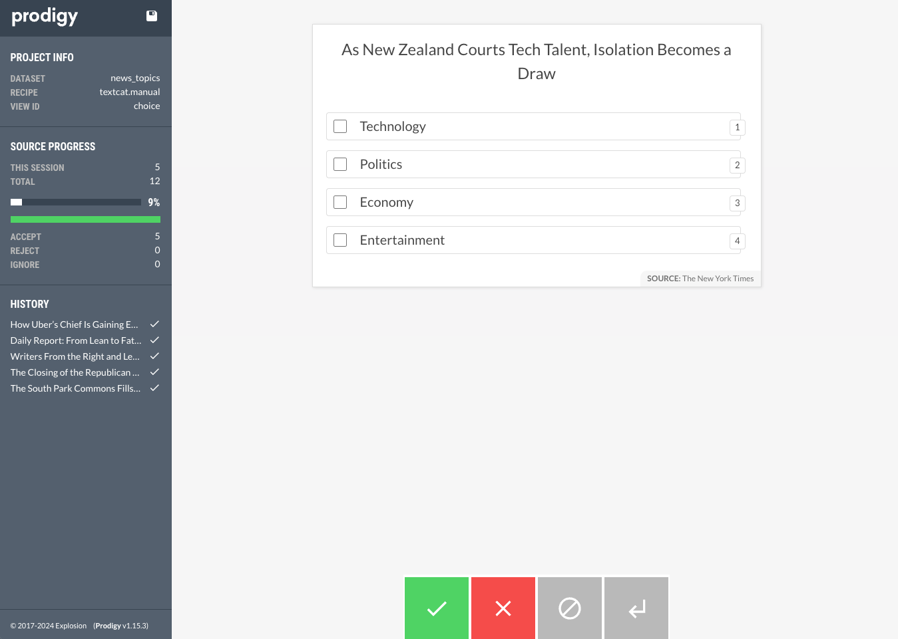

# Prodigy

[Prodigy](https://prodi.gy/) is a modern annotation tool for creating training and evaluation data for machine learning models. You can also use Prodigy to help you inspect and clean your data, do error analysis and develop rule-based systems to use in combination with your statistical models.




Prodigy is a paid annotation tool. You will need a Prodigy is a paid tool. A license is required to download and use it with ZenML.


The Prodigy Python library includes a range of pre-built workflows and command-line commands for various tasks, and well-documented components for implementing your own workflow scripts. Your scripts can specify how the data is loaded and saved, change which questions are asked in the annotation interface, and can even define custom HTML and JavaScript to change the behavior of the front-end. The web application is optimized for fast, intuitive and efficient annotation.

### When would you want to use it?

If you need to label data as part of your ML workflow, that is the point at which you could consider adding the optional annotator stack component as part of your ZenML stack.

### How to deploy it?

The Prodigy Annotator flavor is provided by the Prodigy ZenML integration. You need to install it to be able to register it as an Annotator and add it to your stack:

```shell
zenml integration export-requirements --output-file prodigy-requirements.txt prodigy
```

Note that you'll need to install Prodigy separately since it requires a license. Please [visit the Prodigy docs](https://prodi.gy/docs/install) for information on how to install it. Currently Prodigy also requires the `urllib3<2` dependency, so make sure to install that.

Then register your annotator with ZenML:

```shell
zenml annotator register prodigy --flavor prodigy
# optionally also pass in --custom_config_path="<PATH_TO_CUSTOM_CONFIG_FILE>"
```

See https://prodi.gy/docs/install#config for more on custom Prodigy config files. Passing a `custom_config_path` allows you to override the default Prodigy config.

Finally, add all these components to a stack and set it as your active stack. For example:

```shell
zenml stack copy default annotation
zenml stack update annotation -an prodigy
zenml stack set annotation
# optionally also
zenml stack describe
```

Now if you run a simple CLI command like `zenml annotator dataset list` this should work without any errors. You're ready to use your annotator in your ML workflow!

### How do you use it?

With Prodigy, there is no need to specially start the annotator ahead of time like with [Label Studio](label-studio.md). Instead, just use Prodigy as per the [Prodigy docs](https://prodi.gy) and then you can use the ZenML wrapper / API to get your labelled data etc using our Python methods.

ZenML supports access to your data and annotations via the `zenml annotator ...` CLI command.

You can access information about the datasets you're using with the `zenml annotator dataset list`. To work on annotation for a particular dataset, you can run `zenml annotator dataset annotate <DATASET_NAME> <CUSTOM_COMMAND>`. This is the equivalent of running `prodigy <CUSTOM_COMMAND>` in the terminal. For example, you might run:

```shell
zenml annotator dataset annotate your_dataset --command="textcat.manual news_topics ./news_headlines.jsonl --label Technology,Politics,Economy,Entertainment"
```

This would launch the Prodigy interface for the `textcat.manual` recipe with the `news_topics` dataset and the labels `Technology`, `Politics`, `Economy`, and `Entertainment`. The data would be loaded from the `news_headlines.jsonl` file.

A common workflow for Prodigy is to annotate data as you would usually do, and then use the connection into ZenML to import those annotations within a step in your pipeline (if running locally). For example, within a ZenML step:

```python
from typing import List, Dict, Any

from zenml import step
from zenml.client import Client

@step
def import_annotations() -> List[Dict[str, Any]:
    zenml_client = Client()
    annotations = zenml_client.active_stack.annotator.get_labeled_data(dataset_name="my_dataset")
    # Do something with the annotations
    return annotations
```

If you're running in a cloud environment, you can manually export the annotations, store them somewhere in a cloud environment and then reference or use those within ZenML. The precise way you do this will be very case-dependent, however, so it's difficult to provide a one-size-fits-all solution.

#### Prodigy Annotator Stack Component

Our Prodigy annotator component inherits from the `BaseAnnotator` class. There are some methods that are core methods that must be defined, like being able to register or get a dataset. Most annotators handle things like the storage of state and have their own custom features, so there are quite a few extra methods specific to Prodigy.

The core Prodigy functionality that's currently enabled from within the `annotator` stack component interface includes a way to register your datasets and export any annotations for use in separate steps.

<figure><figcaption></figcaption></figure>
